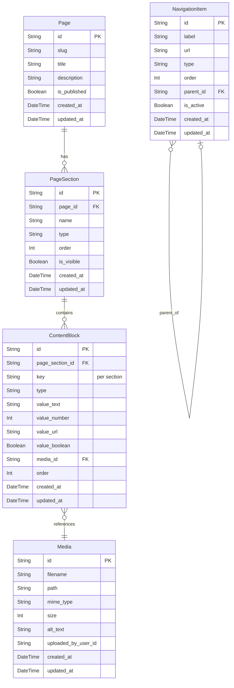

# DATABASE.md: LT3 MEDIA TJKT Dynamic Web & Admin Revamp

## Entity Relationship Diagram (ERD)



## Table Definitions

This section details the primary database tables designed to support the dynamic content management system and interactive hero section. These tables are central to storing all editable content, navigation structures, and media assets.

### Page
Represents a distinct web page on the public website. Each page can have multiple sections.
| Column | Type | Description |
|:---|:---|:---|
| `id` | UUID | Primary key. |
| `slug` | VARCHAR | Unique URL-friendly identifier (e.g., 'home', 'about-us'). |
| `title` | VARCHAR | Display title of the page. |
| `description` | TEXT | SEO-friendly description of the page. |
| `is_published` | BOOLEAN | Indicates if the page is live on the website. |
| `created_at` | DATETIME | Timestamp of creation. |
| `updated_at` | DATETIME | Timestamp of last update. |

### PageSection
Defines a specific content section within a `Page`. For example, a 'Home' page might have 'Hero', 'About Us', and 'Statistics' sections.
| Column | Type | Description |
|:---|:---|:---|
| `id` | UUID | Primary key. |
| `page_id` | UUID | Foreign key referencing the `Page` it belongs to. |
| `name` | VARCHAR | Internal name for the section (e.g., 'hero', 'about_us'). Unique per page. |
| `type` | VARCHAR | Defines the layout/template type for the section (e.g., 'text_image_cta', 'stats_grid'). |
| `order` | INT | Display order of the section within its page. |
| `is_visible` | BOOLEAN | Controls the visibility of the section on the public site. |
| `created_at` | DATETIME | Timestamp of creation. |
| `updated_at` | DATETIME | Timestamp of last update. |

### ContentBlock
Stores individual editable content elements that make up a `PageSection`. This allows for flexible content structures within sections.
| Column | Type | Description |
|:---|:---|:---|
| `id` | UUID | Primary key. |
| `page_section_id` | UUID | Foreign key referencing the `PageSection` it belongs to. |
| `key` | VARCHAR | Unique identifier for the content within its section (e.g., 'title', 'subtitle', 'cta_text', 'image_url'). |
| `type` | VARCHAR | Data type of the content (e.g., 'text', 'richtext', 'image', 'number', 'url', 'boolean'). |
| `value_text` | TEXT | Stores text content (plain or rich HTML). |
| `value_number` | INT | Stores numerical content (e.g., '450 Siswa Aktif'). |
| `value_url` | VARCHAR | Stores URL content. |
| `value_boolean` | BOOLEAN | Stores boolean content (e.g., for toggles). |
| `media_id` | UUID | Optional foreign key referencing a `Media` item for image/file types. |
| `order` | INT | Display order of the content block within its section. |
| `created_at` | DATETIME | Timestamp of creation. |
| `updated_at` | DATETIME | Timestamp of last update. |

### NavigationItem
Manages all navigation elements, including main menu links, social media links, and call-to-action buttons.
| Column | Type | Description |
|:---|:---|:---|
| `id` | UUID | Primary key. |
| `label` | VARCHAR | Display text for the navigation item. |
| `url` | VARCHAR | Target URL for the navigation item. |
| `type` | ENUM | Category of the item (e.g., 'MAIN_MENU', 'SOCIAL_LINK', 'CTA_BUTTON', 'FOOTER_LINK'). |
| `order` | INT | Display order within its group/parent. |
| `parent_id` | UUID | Optional foreign key for hierarchical navigation (sub-menus). |
| `is_active` | BOOLEAN | Controls visibility of the navigation item. |
| `created_at` | DATETIME | Timestamp of creation. |
| `updated_at` | DATETIME | Timestamp of last update. |

### Media
Stores metadata for all uploaded media files (images, documents) used across the website.
| Column | Type | Description |
|:---|:---|:---|
| `id` | UUID | Primary key. |
| `filename` | VARCHAR | Original filename of the uploaded media. |
| `path` | VARCHAR | Storage path or URL to the media file. |
| `mime_type` | VARCHAR | MIME type of the file (e.g., 'image/jpeg', 'application/pdf'). |
| `size` | INT | File size in bytes. |
| `alt_text` | VARCHAR | Alternative text for accessibility and SEO. |
| `uploaded_by_user_id` | UUID | ID of the admin user who uploaded the media. |
| `created_at` | DATETIME | Timestamp of creation. |
| `updated_at` | DATETIME | Timestamp of last update. |

## Prisma Schema

```prisma
// Define enums for specific types
enum NavigationItemType {
  MAIN_MENU
  SOCIAL_LINK
  CTA_BUTTON
  FOOTER_LINK
}

model Page {
  id          String        @id @default(uuid())
  slug        String        @unique
  title       String
  description String?
  isPublished Boolean       @default(false)
  createdAt   DateTime      @default(now())
  updatedAt   DateTime      @updatedAt

  sections    PageSection[]
}

model PageSection {
  id          String         @id @default(uuid())
  pageId      String
  name        String         // e.g., "hero", "about_us", "statistics"
  type        String         // e.g., "text_image_cta", "stats_grid", "gallery" - flexible string for custom layouts
  order       Int            @default(0)
  isVisible   Boolean        @default(true)
  createdAt   DateTime       @default(now())
  updatedAt   DateTime       @updatedAt

  page        Page           @relation(fields: [pageId], references: [id], onDelete: Cascade)
  contentBlocks ContentBlock[]

  @@unique([pageId, name]) // A page cannot have two sections with the same name
  @@index([pageId, order])
}

model ContentBlock {
  id            String        @id @default(uuid())
  pageSectionId String
  key           String        // e.g., "title", "subtitle", "image_url", "cta_text", "stat_count_1"
  type          String        // e.g., "text", "richtext", "image", "number", "url", "boolean"
  valueText     String?       @db.Text // For text, richtext, url
  valueNumber   Int?          // For numbers, stats
  valueUrl      String?       // For explicit URLs
  valueBoolean  Boolean?      // For toggles

  mediaId       String?       // Optional reference to a Media item for image/file types
  order         Int           @default(0)
  createdAt     DateTime      @default(now())
  updatedAt     DateTime      @updatedAt

  pageSection   PageSection   @relation(fields: [pageSectionId], references: [id], onDelete: Cascade)
  media         Media?        @relation(fields: [mediaId], references: [id], onDelete: SetNull)

  @@unique([pageSectionId, key]) // A section cannot have two content blocks with the same key
  @@index([pageSectionId, order])
}

model NavigationItem {
  id          String           @id @default(uuid())
  label       String
  url         String
  type        NavigationItemType
  order       Int              @default(0)
  parentId    String?
  isActive    Boolean          @default(true)
  createdAt   DateTime         @default(now())
  updatedAt   DateTime         @updatedAt

  parent      NavigationItem?  @relation("SubNavigationItems", fields: [parentId], references: [id], onDelete: SetNull)
  children    NavigationItem[] @relation("SubNavigationItems")

  @@index([parentId, order])
  @@index([type, order])
}

model Media {
  id            String         @id @default(uuid())
  filename      String
  path          String         // Full path or relative path to storage
  mimeType      String
  size          Int            // Size in bytes
  altText       String?
  uploadedByUserId String?     // ID of the user who uploaded it (assuming User model exists elsewhere)
  createdAt     DateTime       @default(now())
  updatedAt     DateTime       @updatedAt

  contentBlocks ContentBlock[] // A media item can be referenced by multiple content blocks
}
```